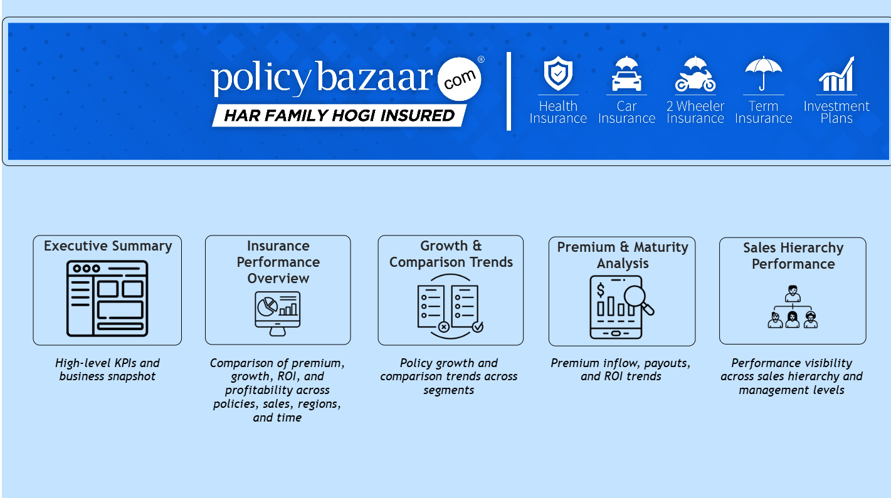
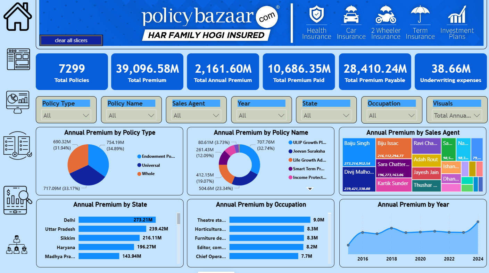
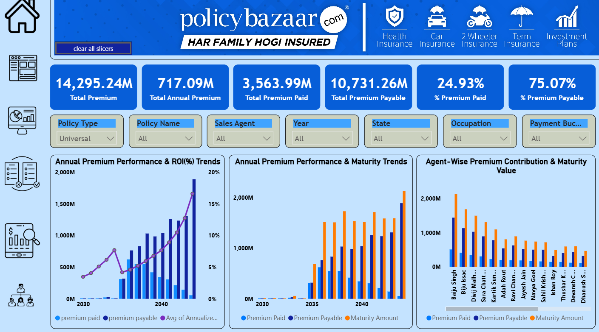
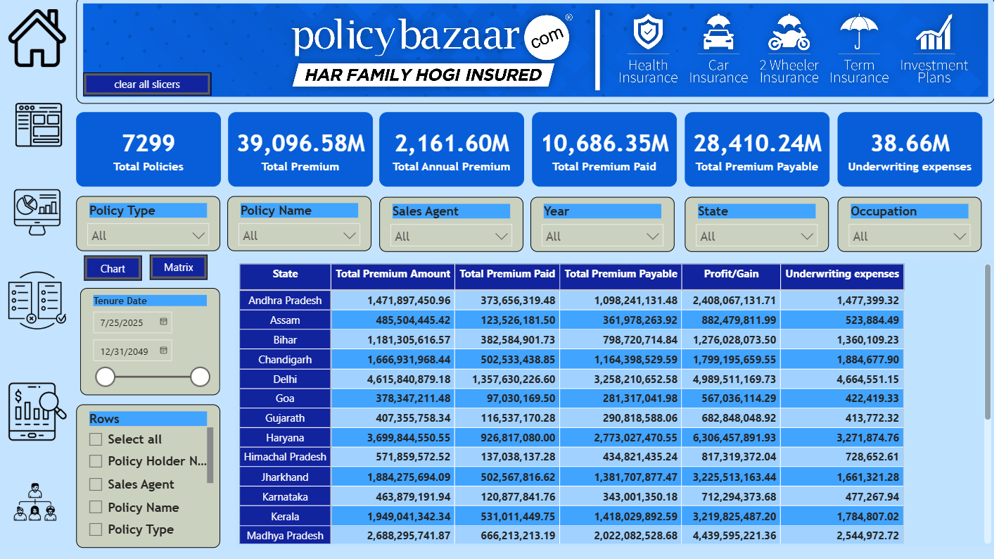

# 📊 PolicyBazaar Insurance Premium & Payout KPI Analytics – Power BI Dashboard

---

## 📌 Project Overview
This project presents an interactive **Power BI insurance analytics dashboard** built using an **AI-generated dataset inspired by PolicyBazaar**, covering the period **2015–2024**. The report provides a **single, unified view of the insurance business**, enabling stakeholders to monitor policy performance, analyze premiums and payouts, assess maturity outcomes, and evaluate overall business growth.

> ⚠️ **Note:** This project is created for portfolio purposes and does not use real PolicyBazaar data.

---

## 🎯 Business Goals
The primary objective of this project is to support **data-driven decision-making** across insurance operations by analyzing the **complete policy lifecycle** for active policies.

### Key Business Questions Addressed
- How are different insurance policy types performing across customer segments?
- Which states and regions are overperforming or underperforming?
- Which policy plans are top performers, and which have low customer uptake?
- How efficiently are claims being settled, and where do bottlenecks exist?
- How can sales, claims, and loan servicing teams be evaluated for accountability and performance?

---

## 🗂️ Data Model

---

## 🔗 Live Dashboard
[View Dashboard](https://app.powerbi.com/view?r=eyJrIjoiOGVmZGNhY2ItOWIyNi00MTZhLTg2ODgtOTM3NjIyNDA0YmZhIiwidCI6IjE3ZDc5MTIxLTY4M2EtNDNlNS1iNTIwLWFjYTE5ZTc1MGU5OSJ9&pageName=f28a1e9e7a399c571eb0)

---

## 📊 Dashboard Views & Features

### 📌 Executive Summary
High-level snapshot of overall insurance business performance with key KPIs and health indicators.

### 📈 Insurance Performance Overview
Analyze premium, growth, ROI, and profitability across:
- Policy types
- Customer segments
- Regions
- Time periods

### 📊 Growth & Comparison Trends
Track policy growth patterns and compare performance trends across multiple dimensions and time periods.

### 💰 Premium & Maturity Analysis
Examine premium inflows, maturity payouts, ROI trends, and profitability to assess overall financial performance.

### 🧩 Sales Hierarchy Performance
Evaluate performance across the sales hierarchy with visibility into:
- Zonal Managers
- Regional Managers
- Sales Agents
- Policyholders

---

## 🗂️ Data Sources
- **Snowflake:** AI-generated insurance data (CSV files) was loaded and stored in Snowflake tables.

- **Power BI (Import Mode):** Data was pulled from Snowflake into Power BI, where the **Star Schema** data model was created.

---

## 📈 Key KPIs Tracked
- Total Premium Amount
- Total Annual Premium
- Total Premium Paid
- Total Premium Payable
- Maturity Amount
- Profit / Gain
- Annualized ROI (%)
- Underwriting Expenses
- CAGR (%) – Compound Annual Growth Rate

---

## 🛠 Tools Used
- **Microsoft Excel** – Data preparation (CSV format)
- **Power BI** – Data modeling, DAX, and dashboard visualization
- **Snowflake** – Cloud data storage

---

## 🖥️ Project Dashboard Views

### Home Page

### Executive Summary

### Insurance Performance Overview

### Growth & Comparison Trends

### Premium & Maturity Analysis

### Sales Hierarchy Performance

---

## 🔍 Filters & Interactivity
Users can dynamically slice data by:
- Policy Type
- Policy Name
- Sales Agent
- Year
- State
- Occupation
- Tenure & Payment Buckets

---

## 📘 Key Learnings in Power BI
- Loading and importing data from **Snowflake into Power BI (Import Mode)**
- Working with **AI-generated CSV datasets**
- Data cleaning and transformation using **Power Query**
- Designing a **Star Schema** data model
- Understanding **Fact and Dimension tables**
- Creating **measures and calculated columns using DAX**
- Implementing **Row-Level Security (RLS)** for role-based access
- Building **interactive dashboards** with slicers, drill-downs, and tooltips
- Applying **UI/UX best practices** for executive dashboards

---

## 🧠 Skills Gained
- Power BI data modeling (Star Schema)
- DAX calculations and KPI development
- Power Query (ETL)
- Interactive dashboard design
- Insurance domain KPI understanding
- Business-focused data storytelling
- Stakeholder-oriented reporting
- Sales hierarchy analytics
- Performance optimization

---

## 🚀 Project Outcome
The dashboard delivers a **single unified view of insurance business performance** across policies, premiums, maturity, and sales hierarchy.

It enables stakeholders to:
- Identify high- and low-performing insurance products
- Monitor regional and customer segment performance
- Evaluate sales effectiveness across management levels
- Improve decision-making and operational efficiency

This project demonstrates the ability to translate **complex insurance data into actionable insights** using Power BI.

---

## 📌 Future Enhancements
- Claims fraud detection indicators
- Predictive maturity forecasting
- Customer Lifetime Value (CLV) analysis
- Policy churn analysis
